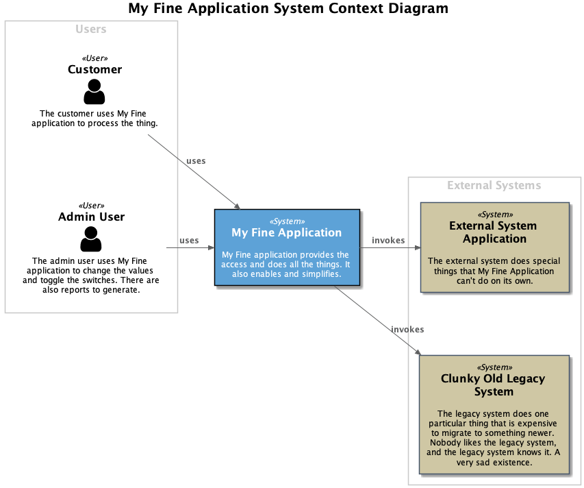
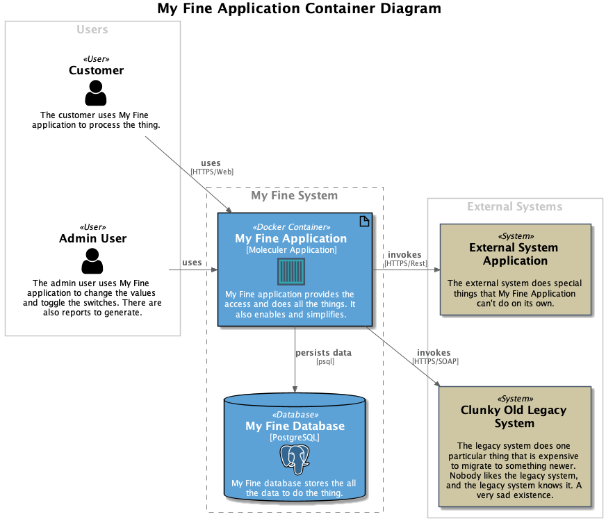

# PlantUML styles for C4-like Diagrams

I've created a handful of PlantUML procedures to create [C4](https://c4model.com/)-style diagrams that retain a certain amount of UML representation. 

C4 doesn't recommend a standard diagrammatic style (even though Brown almost-universally uses a set of blue and grey boxes with arrows), and I still have a fondness for UML, so that's what I tend to model in. But all of Brown's recommendations about titles, labels, descriptions, and icons are great recommendations: the procedures just make it easier to lay that stuff out.

Obviously, if you prefer Brown's style, you should probably look in to the [PlantUML-bundled C4 Standard Library](https://github.com/plantuml-stdlib/C4-PlantUML "C4: It's not just for breakfast!"). It's probably also more complete than this library will ever be.

## System Context Diagram

The System Context Diagram doesn't really map neatly to any particular UML-style diagram (except, perhaps, as a simplified version of a UML Deployment Diagram). Because of the simplified nature, systems are represented as basic rectangles.

## Container Diagram

I have a bit of a love/hate relationship with the C4 notion of "containers." First up, the name "container" has been so completely staked out by Docker, that C4's container language is always going to have to do extra work to get the listener to understand that C4 containers have nothing to do with Docker.

Instead, I prefer to think in terms of UML artifacts. While Brown is very clear that he doesn't think that there's a 1-to-1 relationship between artifacts and containers, the distinctions aren't so great that you can't do a bit of substitution.

